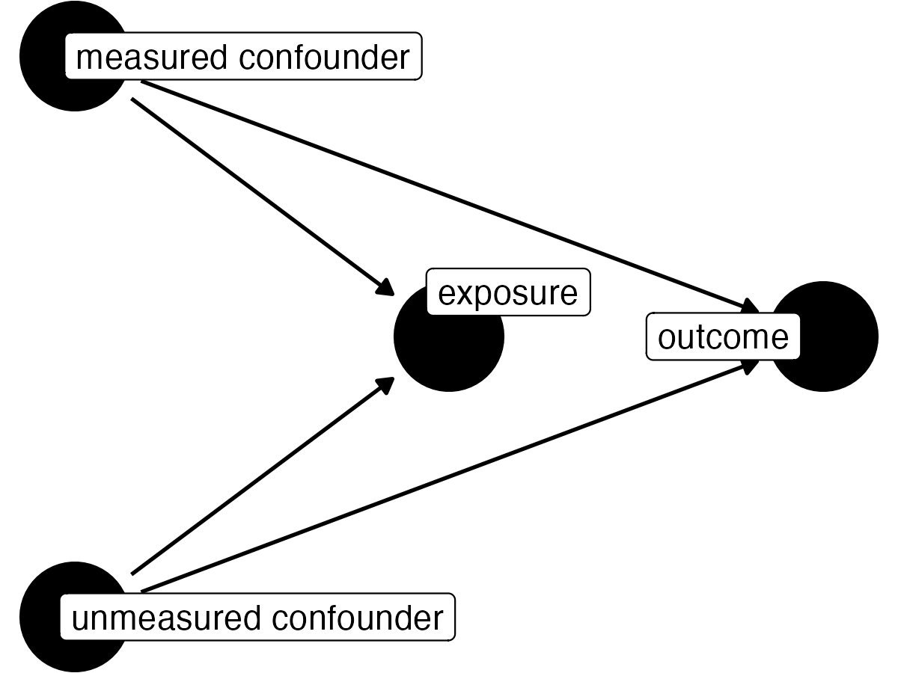

# Summary

The strength of evidence provided by epidemiological and observational studies is inherently limited by the potential for unmeasured confounding. We focus on three key quantities: the observed bound of the confidence interval closest to the null, the relationship between an unmeasured confounder and the outcome, for example a plausible residual effect size for an unmeasured continuous or binary confounder, and the relationship between an unmeasured confounder and the exposure, for example a realistic mean difference or prevalence difference for this hypothetical confounder between exposure groups. Building on the methods put forth by  @Cornfield, @Bross, @Schlesselman, @Rosenbaum:1983, @Lin, @lash2009applying, @rosenbaum1986dropping, @cinelli2020making, @VanderWeele:2017ki, and @Ding, we can use these quantities to assess how an unmeasured confounder may tip our result to insignificance, rendering the study inconclusive.

# Statement of need

When assessing the relationship between an exposure and an outcome, the "no unmeasured confounders" assumption is crucial.[@rubin1974estimating; @DAgostino:1998tu] This assumption, however, is untestable, rendering sensitivity analyses necessary to quantify the potential impact of unmeasured confounding. There are several related methods for conducting sensitivity analyses for unmeasured confounders [@Cornfield; @Bross; @Schlesselman; @Rosenbaum:1983; @Lin; @lash2009applying; @rosenbaum1986dropping; @cinelli2020making; @VanderWeele:2017ki; @Ding], some of which have their own R packages, for example methods in @cinelli2020making can be implemented using the `sensemakr` R package, `obsSens` implements methods from @Lin, and `EValue` implements methods in @VanderWeele:2017ki. However, there is not currently a single R package that has a unified grammar allowing the user to conduct appropriate sensitivity analysis for their study. A unified grammar allows the user to easily transition between methods depending on the scenario under which they are conducting the sensitivity analysis as well as compare the results between methods. `tipr` seeks to fill this need.

# Overview 

The `tipr` R package [@rstats] allows the user to conduct sensitivity analyses for unmeasured confounding. The user provides an "observed effect" (that is, some effect between an exposure of interest and an outcome of interest after adjusting for any observed confounders), and the sensitivity analyses will quantify how sensitive the effect is to a potential unmeasured confounder.  The `tipr` functions fall into three categories:

(1) Functions that calculate how an observed effects would change with a specified unmeasured confounder (`adjust` functions)
(2) Functions that calculate the magnitude of an unmeasured confounder needed to tip an observed effect to cross the null, rendering it inconclusive (`tip` functions)
(3) Functions that calculate single number summaries of an observed effect's "sensitivity", such as the E-value [@VanderWeele:2017ki] or Robustness value  [@cinelli2020making].

`tipr` is available on [CRAN](https://github.com/lucymcgowan/tipr) and [Github](https://github.com/lucymcgowan/tipr). Documentation can be found at 
https://lucymcgowan.github.io/tipr/. It can be installed from CRAN using the 
following code:

```{r}
install.packages("tipr")
```

The development version can be installed from Github using the following code:

```{r}
devtools::install_github("LucyMcGowan/tipr")
```

The library can be loaded by running:

```{r}
library(tipr)
```

# Unmeasured confounder parameterization

Informally, a confounder is a pre-exposure variable that is associated with both the exposure of interest and outcome of interest but is *not* on the causal pathway between the two.[@vanderweele2013definition; @van2010confounding]. There are two quantities that measure the strength of an unmeasured confounder -- the relationship between the unmeasured confounder and the exposure and the strength of the unmeasured confounder and the outcome. The `tipr` package allows these quantities to be specified in a number of ways. 

## Unmeasured confounder - exposure relationship

If quantifying the impact of a standardized Normally distributed confounder, the impact of the unmeasured confounder on the exposure is parameterized as a difference in means between the unmeasured confounder in the exposed population and the unexposed population. By "standardized Normally distributed" we mean that the unmeasured confounder is Normally distributed with mean $\mu_1$ for the exposed and $\mu_0$ for the unexposed and unit variance. (Note a standardized Normally distributed confounder can be created from a Normally distributed confounder by dividing by the variance). This is specified using the `exposure_confounder_effect` parameter. If quantifying the impact of a binary confounder, the impact is quantified using two parameters, `exposed_confounder_prev`: The estimated prevalence of the unmeasured confounder in the unexposed population and `unexposed_confounder_prev`: The estimated prevalence of the unmeasured confounder in the unexposed population. Finally, the user can choose to quantify the magnitude of the unmeasured confounder-exposure relationship in terms of the percent of variation in the exposure explained by the unmeasured confounder. This is specified using the `confounder_exposure_r2` parameter. 

## Unmeasured confounder - outcome relationship

If quantifying the impact of a standardized Normally distributed confounder or binary confounder, the impact of the unmeasured confounder on the outcome is parameterized as the anticipated effect size of the unmeasured confounder if it were included in the final outcome model. This effect will be on the same scale as the input observed effect. For example, if the observed effect is a *coefficient* in a linear regression model, this effect would also be a coefficient; if the observed effect is a *hazard ratio* from a Cox proportional hazards model, this effect would also be a hazard ratio. This is specified using the `confounder_outcome_effect` parameter. Alternatively, the user can choose to quantify the magnitude of the unmeasured confounder-outcome relationship in terms of the percent of variation in the outcome explained by the unmeasured confounder. This is specified using the `confounder_outcome_r2` parameter. 

# Syntax

The functions in the `tipr` package follow a unified grammar. The function names follow this form: `{action}_{effect}_with_{what}`. For example, to adjust (`action`) a coefficient (`effect`) with a binary unmeasured confounder (`what`), we use the function `adjust_coef_with_binary()`. The full list of `action`s `effect`s and `what`s is summarized in Table 1. The "default" function assumes the confounder type is Normally distributed, therefore `adjust_coef()` is equivalent to `adjust_coef_with_continuous()`.


**Table 1**. Grammar of `tipr` functions.
+----------+--------------------+----------------------------------------------+
| category | Function term      | Use                                          |
+==========+====================+==============================================+
|**action**| `adjust`           | These functions adjust observed effects,     |
|          |                    | requiring between both the unmeasured        |
|          |                    | confounder-exposure relationship and         |
|          |                    | unmeasured confounder-outcome relationship to|
|          |                    | be specified.                                |
+----------+--------------------+----------------------------------------------+
+----------+--------------------+----------------------------------------------+
|          | `tip`              | These functions tip observed effects. Only   |
|          |                    | one relationship, either the unmeasured      |
|          |                    | confounder-exposure relationship or          |
|          |                    | unmeasured confounder-outcome relationship   |
|          |                    | needs to be specified.                       |
+----------+--------------------+----------------------------------------------+
+----------+--------------------+----------------------------------------------+
|**effect**| `coef`             | These functions specify an observed          |
|          |                    | coefficient from a linear, log-linear,       |
|          |                    | logistic, or Cox proportional hazards model  |
+----------+--------------------+----------------------------------------------+
+----------+--------------------+----------------------------------------------+
|          | `rr`               | These functions specify an observed          |
|          |                    | relative risk                                |
+----------+--------------------+----------------------------------------------+
+----------+--------------------+----------------------------------------------+
|          | `or`               | These functions specify an observed          |
|          |                    | odds ratio                                   |
+----------+--------------------+----------------------------------------------+
+----------+--------------------+----------------------------------------------+
|          | `hr`               | These functions specify an observed          |
|          |                    | hazard ratio                                 |
|          |                    |  
+----------+--------------------+----------------------------------------------+
+----------+--------------------+----------------------------------------------+
|**what**  | `continuous`       | These functions specify an unmeasured 
|          |                    | standardized Normally distributed confounder. 
|          |                    | These functions will include the parameters
|          |                    | `exposure_confounder_effect` and 
|          |                    | `confounder_outcome_effect`
+----------+--------------------+----------------------------------------------+
+----------+--------------------+----------------------------------------------+
|          | `binary`           | These functions specify an unmeasured binary
|          |                    | confounder. These functions will include the 
|          |                    | parameters `exposed_confounder_prev`, 
|          |                    | `unexposed_confounder_prev`, and
|          |                    | `confounder_outcome_effect`
+----------+--------------------+----------------------------------------------+
+----------+--------------------+----------------------------------------------+
|          | `r2`               | These functions specify an unmeasured 
|          |                    | parameterized by specifying the percent of 
|          |                    | variation in the exposure / outcome explained 
|          |                    | by the unmeasured confounder. These functions 
|          |                    | will include the parameters 
|          |                    | `confounder_exposure_r2` and 
|          |                    | `outcome_exposure_r2`
+----------+--------------------+----------------------------------------------+

The first argument of each function is `effect_observed` quantifying the observed exposure-outcome relationship. The functions intended to adjust an effect with partial $R^2$ values specified are built on the `sensemakr` package [@sensemakr] and have the following additional arguments: `se`: The standard error fo the observed exposure - outcome relationship and `df`: The residual degrees of freedom from the model used to fit the observed exposure - outcome relationship. This is the total number of observations minus the number of parameters estimated in your model. Often for models estimated with an intercept this is $N - k - 1$ where $k$ is the number of predictors in the model. The subsequent parameters in each function describe the unmeasured confounder's relationship with the exposure and outcome for the `adjust` functions, and one or the other for the `tip` functions.

The output for all functions is a data frame with the adjusted effect in the first column, the observed effect in the second column, and the specified sensitivity parameters in the subsequent columns. For example, if we want to know the impact of an unmeasured confounder with `exposure_confounder_effect = 0.1` and `confounder_outcome_effect = 1` on an observed `effect = 1.5`, we would run the following code.

```r
library(tipr)
adjust_coef(effect_observed = 1.5,
            exposure_confounder_effect = 0.1,
            confounder_outcome_effect = 1)
```

    ## The observed effect (1.5) is updated to 1.4 by a confounder with the 
    ## following specifications:
    ##  * estimated difference in scaled means: 0.1
    ##  * estimated relationship between the unmeasured confounder and the 
    ##    outcome: 1
    ## # A tibble: 1 × 4
    ##  effect_adjusted effect_observed exposure_confounder_effect confounder_outcom…
    ##            <dbl>           <dbl>                      <dbl>              <dbl>
    ##             1.4             1.5                        0.1                 1


Additionally, there are two function, `e_value`, and `r_value` that calculate single number summaries of the sensitivity of a particular observed effect to unmeasured confounding,the E-value and Robustness value, respectively.

# Tipping Point Example

The package includes a few example data sets. `exdata_rr` contains data simulated such that there is a binary exposure, a binary outcome, and two Normally distributed confounders, one "measured" (so included in the analysis) and one "unmeasured". There is no true causal effect between the exposure and outcome. The true causal diagram is shown below.



We can fit the observable model as follows:

```r
glm(outcome ~ exposure + measured_confounder, 
    data = exdata_rr,
    family = poisson)
```

After fitting your model, you can determine the unmeasured confounder
needed to tip your analysis. In this example, the exposure-outcome relationship is a relative risk of 1.5 (95% CI: 1.1, 2.1).

We are interested in a Normally distributed unmeasured confounder, so we can use the `tip_rr_with_continuous()` function. The function `tip()` is an alias for this function.

Let’s assume the relationship between the unmeasured confounder and exposure is 0.5 (`exposure_confounder_effect = 0.5`), let's solve for the relationship between unmeasured confounder and outcome needed to tip the analysis (in this case, we are solving for `confounder_outcome_effect`).

``` r
tip(1.1, exposure_confounder_effect = 0.5)
```

    ## The observed effect (1.1) WOULD be tipped by 1 unmeasured confounder
    ## with the following specifications:
    ##   * estimated difference in scaled means between the unmeasured 
    ##     confounder in the exposed population and unexposed population: 0.5
    ##   * estimated association between the unmeasured confounder and 
    ##     the outcome: 1.21
    ## 
    ## 
    ## # A tibble: 1 × 5
    ##   effect_adjusted effect_observed exposure_confound… confounder_outcome… 
    ##             <dbl>           <dbl>              <dbl>                <dbl>
    ## 1               1             1.1                0.5                 1.21
    ## # … with 1 more variable: n_unmeasured_confounders <dbl>

A hypothetical unobserved continuous confounder that has a effect
of 1.1 with the outcome would need a relationship with the outcome of `1.21` to tip this analysis at the 5% level, rendering it inconclusive.

# Conclusion

The `tipr` package facilitates sensitivity analyses for unmeasured confounding, building on the methods put forth by
 @Cornfield, @Bross, @Schlesselman, @Rosenbaum:1983, @Lin, @lash2009applying, @rosenbaum1986dropping, @cinelli2020making, @VanderWeele:2017ki, and @Ding. The `adjust` functions allow an investigator to examine how a specific (or set of specific) confounders would change a result while the `tip` functions provide sensitivity analyses that allow an investigator to examine how extreme an unmeasured confounder would need to be in order to change the direction of the effect, and thus often the conclusions of the study.

# References
